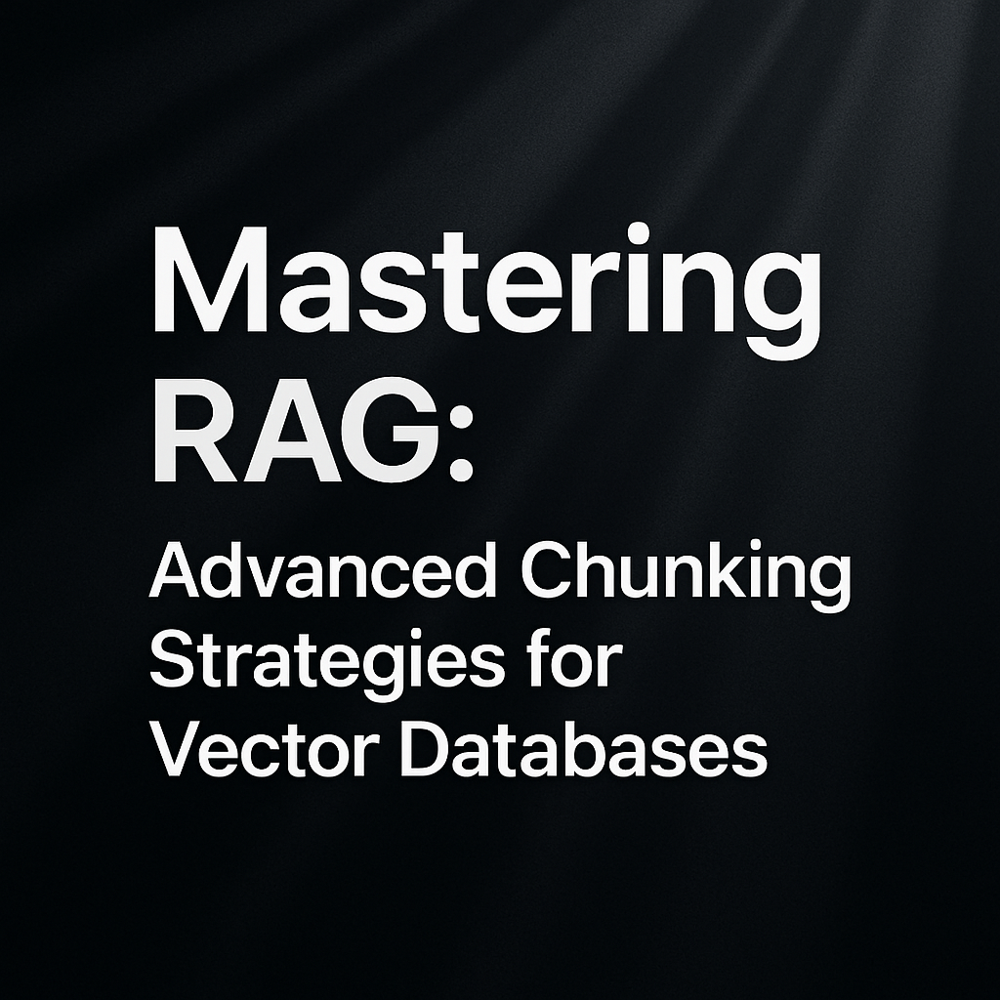
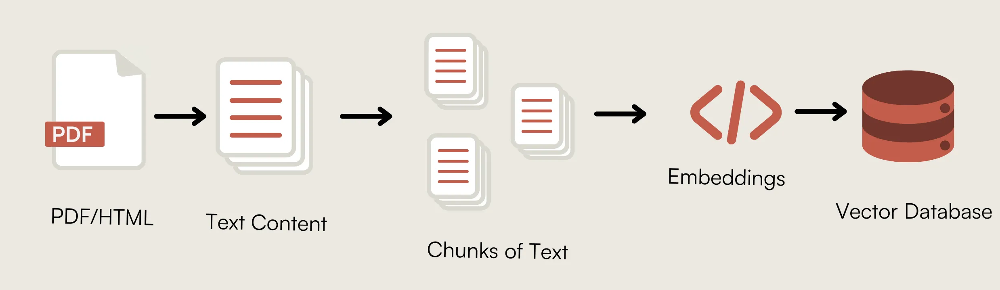

# Advanced Chunking Strategies for Vector Databases
[](https://medium.com/@subhashbs36/mastering-rag-advanced-chunking-strategies-for-vector-databases-b6e2cbb042d3)

Chunking Illustration component in the RAG (Retrieval Augmented Generation) ecosystem, where text is split into manageable pieces that can be embedded into vector databases. This repository explores various chunking strategies based on research from ChromaDB and other sources to help you find the optimal approach for your RAG applications.



## Why Chunking Matters

Effective chunking ensures:
- Input text stays under token limits of embedding models
- Search results accurately capture the essence of user queries
- Semantic integrity is preserved through appropriate context
- Retrieval quality is optimized for downstream applications

As a rule of thumb: if a chunk of text makes sense to a human without surrounding context, it will make sense to a language model as well.

## Chunking Strategies

### 1. Character/Token Based Chunking

This approach splits text into fixed-size segments based on character or token count.

```python
from langchain.text_splitter import CharacterTextSplitter

# Fixed-size character chunking
text_splitter = CharacterTextSplitter(
    separator="\n\n",
    chunk_size=1000,
    chunk_overlap=200
)
chunks = text_splitter.split_text(document)
```

**Benefits**: Simple implementation, predictable chunk sizes, works well for homogeneous content.

### 2. Recursive Character/Token Based Chunking

This method recursively splits text based on a hierarchy of separators (paragraphs, sentences, etc.).

```python
from langchain.text_splitter import RecursiveCharacterTextSplitter

# Recursive token chunking
text_splitter = RecursiveCharacterTextSplitter(
    separators=["\n\n", "\n", ". ", " ", ""],
    chunk_size=500,
    chunk_overlap=50,
    length_function=len
)
chunks = text_splitter.split_text(document)
```

**Benefits**: Preserves natural text boundaries and maintains semantic coherence.

### 3. Semantic Chunking

Documents are split based on semantic similarity rather than arbitrary character counts.

```python
from langchain_experimental.text_splitter import SemanticChunker
from langchain_openai import OpenAIEmbeddings

# Semantic chunking
embeddings = OpenAIEmbeddings()
text_splitter = SemanticChunker(embeddings)
chunks = text_splitter.split_text(document)
```

**Benefits**: Creates chunks with coherent meaning and variable chunk size based on content semantics.

### 4. Cluster Semantic Chunking

This technique first splits documents into sentence groups, then clusters similar sentences together.

```python
# Using the ClusterSemanticChunker from the chunking_evaluation package
cluster_chunker = ClusterSemanticChunker(
    embedding_function=embedding_function, 
    max_chunk_size=400, 
    length_function=openai_token_count
)
chunks = cluster_chunker.split_text(document)
```

**Benefits**: Groups related content regardless of position in document and handles documents with diverse topics.

### 5. LLM Semantic Chunking

Leverages LLMs to intelligently split documents based on content understanding.

```python
# Using the LLMSemanticChunker from the chunking_evaluation package
llm_chunker = LLMSemanticChunker(
    organisation="openai", 
    model_name="gpt-4o", 
    api_key=os.environ["OPENAI_API_KEY"]
)
chunks = llm_chunker.split_text(document)
```

**Benefits**: Most semantically aware chunking, can understand document structure and topic boundaries.

## Evaluation Results

Based on research evaluating these chunking strategies, here are the key findings:

| Chunking Strategy | Chunk Size | Recall | Precision | IoU |
|-------------------|-----------|--------|-----------|-----|
| Fixed token without overlap | 200 | 90.0% | 7.0% | 7.0% |
| Fixed token with overlap | 200 | 100.0% | 5.4% | 5.4% |
| Recursive without overlap | 200 | 88.1% | 7.0% | 7.0% |
| ClusterSemantic | 200 | 89.2% | 8.0% | 8.0% |
| LLMSemantic | N/A | 91.9% | 6.5% | 6.5% |

The **recursive character text splitter with chunk size 200 and no overlap** performs consistently well across all metrics while being simpler to implement than semantic approaches.

## Best Practices

1. **Chunk Size**: Smaller chunks (200-400 tokens) generally perform better than larger ones (800+ tokens)
2. **Overlap**: Reducing chunk overlap generally improves efficiency by reducing redundant information
3. **Method Selection**: 
   - For simple implementation: RecursiveCharacterTextSplitter with 200-400 token chunks and no overlap
   - For maximum performance: ClusterSemanticChunker with 200-400 tokens

## Getting Started

To use this repository:

1. Clone the repo
```bash
git clone https://github.com/yourusername/chunking-strategies.git
cd chunking-strategies
```

2. Install dependencies
```bash
pip install -r requirements.txt
```

3. Run the example notebook
```bash
jupyter notebook examples/chunking_comparison.ipynb
```

## Contributing

Contributions are welcome! Please feel free to submit a Pull Request.

## License

This project is licensed under the MIT License - see the LICENSE file for details.

## Acknowledgments

- Research from [ChromaDB](https://trychroma.com) on evaluating chunking strategies
- LangChain for text splitting implementations
- The chunking_evaluation package for implementation of advanced chunking strategies

## References

- [The BEST Way to Chunk Text for RAG](https://www.youtube.com/watch?v=Pk2BeaGbcTE&ab_channel=AdamLucek) by AdamLucek
- [Evaluating Chunking Strategies for Retrieval](https://research.trychroma.com/evaluating-chunking) by ChromaDB (July 2024)
- [Chunking Strategies for LLM Applications](https://www.pinecone.io/learn/chunking-strategies/) by Pinecone (March 2025)
- [7 Chunking Strategies in RAG You Need To Know](https://www.f22labs.com/blogs/7-chunking-strategies-in-rag-you-need-to-know/) by F22 Labs

Citations:
[1] https://ppl-ai-file-upload.s3.amazonaws.com/web/direct-files/attachments/48060358/53655baf-c8bf-4563-8d76-4408b47b69db/chunking.ipynb
[2] https://ppl-ai-file-upload.s3.amazonaws.com/web/direct-files/attachments/48060358/53655baf-c8bf-4563-8d76-4408b47b69db/chunking.ipynb
[3] https://github.com/sweepai/sweep/blob/main/notebooks/chunking.ipynb
[4] https://www.f22labs.com/blogs/7-chunking-strategies-in-rag-you-need-to-know/
[5] https://github.com/IBM/rag-chunking-techniques/blob/main/smart-chunking.ipynb
[6] https://www.pinecone.io/learn/chunking-strategies/
[7] https://research.trychroma.com/evaluating-chunking
[8] https://quarto.org/docs/reference/formats/ipynb.html
[9] https://www.edutopia.org/article/chunking-content-classroom/
[10] https://www.reddit.com/r/LangChain/comments/1bgqc2o/optimal_way_to_chunk_word_document_for/
[11] https://github.com/vectara/example-notebooks/blob/main/notebooks/chunking-demo.ipynb
[12] https://www.reddit.com/r/LangChain/comments/14503y6/best_chunking_strategy_for_detailed_answers/
[13] https://stackoverflow.com/questions/68982581/is-it-possible-to-set-a-jupyter-notebook-chunk-to-run-with-a-certain-delay-after
[14] https://www.teacherspayteachers.com/browse/english-language-arts/informational-text?search=chunking+strategies
[15] https://community.openai.com/t/what-is-the-best-way-to-chunk-a-pdf-file-for-rag-in-a-smart-way-that-preserves-the-meaning-during-retrieval/654863
[16] https://www.ibm.com/think/tutorials/chunking-strategies-for-rag-with-langchain-watsonx-ai
[17] https://www.reddit.com/r/GetStudying/comments/1fjvhsf/how_to_study_for_textbooks_how_to_chunking/
[18] https://www.superteams.ai/blog/a-deep-dive-into-chunking-strategy-chunking-methods-and-precision-in-rag-applications
[19] https://colab.research.google.com/github/pinecone-io/examples/blob/master/learn/generation/langchain/handbook/xx-langchain-chunking.ipynb
[20] https://colab.research.google.com/github/lancedb/vectordb-recipes/blob/main/tutorials/Langchain-LlamaIndex-Chunking/Langchain_Llamaindex_chunking.ipynb
[21] https://stackoverflow.com/questions/79319662/chunking-documents-for-azure-ai-search-rag
