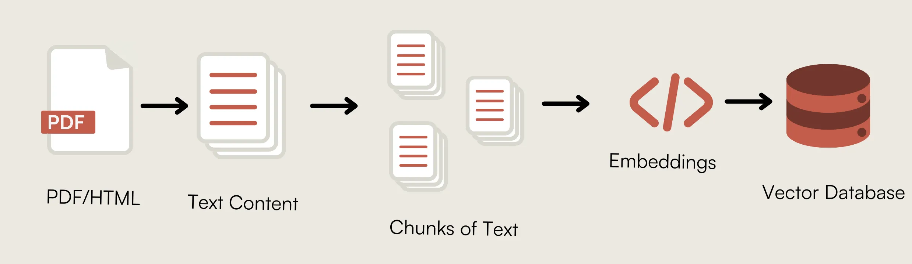

# Chunking Strategies for Vector Databases

A critical component in the RAG ecosystem is document chunking- the process of splitting text into manageable pieces that can be embedded into your vectordatabase. Most people choose one chunking method and stick with it, but what if there's a *best* method?

Researchers at [ChromaDB](https://trychroma.com) evaluated many variations of popular chunking methods, as well as created some new ones, to try and find the best overall method for preparing unstructured text data for downstream RAG applications.

We'll be putting their latest research [Evaluating Chunking Strategies for Retrieval](https://research.trychroma.com/evaluating-chunking) to the test to show how each strategy works and find the best one for us.

**This will Cover**: 
1. Character/Token Based Chunking
2. Recursive Character/Token Based Chunking
3. Semantic Chunking
4. Cluster Semantic Chunking
5. LLM Semantic Chunking
